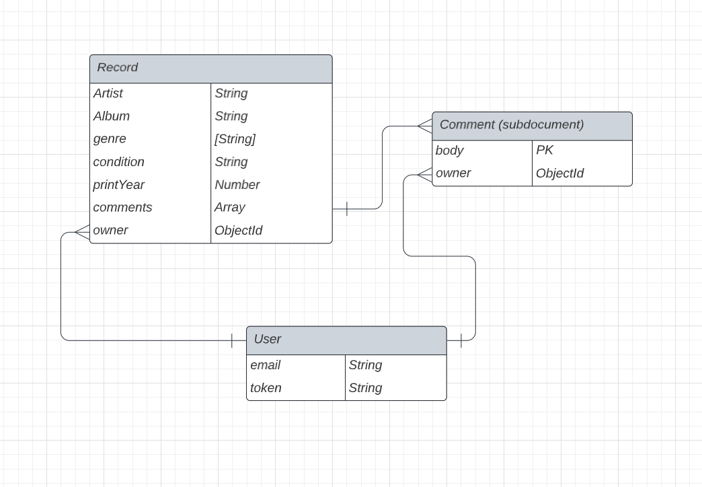

# Audio Caddy - The record collection tracker

Keep track of your record collection! I am an avid record collector, and I though it would be fun to have a simple collection tracker so I can always have access to my collection. Sometimes when you are on the go and you are shopping for new records you may forget if you already have a record in your collection, and this app will be there to prevent that from happening.

## Technologies Used

- JavaScript
- Mongoose ODB
- MongoDB
- Express.js
- bcrypt
- CORS
- passport-jwt
- passport
- jsonwebtoken

## Entity Relationships

## Routes Table

|  Name   |     Path      | HTTP Verb |                  Purpose                |
|---------|---------------|-----------|-----------------------------------------|
| Index   | /records      | GET       | Displays all records of the current user|
| Create  | /records      | POST      | Creates a new record                    |
| Show    | /record       | GET       | Shows a single record                   |
| Update  | /records/:id  | PATCH     | Updates a single record's fields        |
| Delete  | /records/:id  | DELETE    | Deletes a single record                 |
| Create  | /comments     | POST      | Creates a new comment on a record       |
| Delete  | /comments/:id | DELETE    | Deletes a comment                       |
| Create  | /sign-up      | POST      | Creates a new user                      |
| Create  | /sign-in      | POST      | Logs user in, creates new token         |