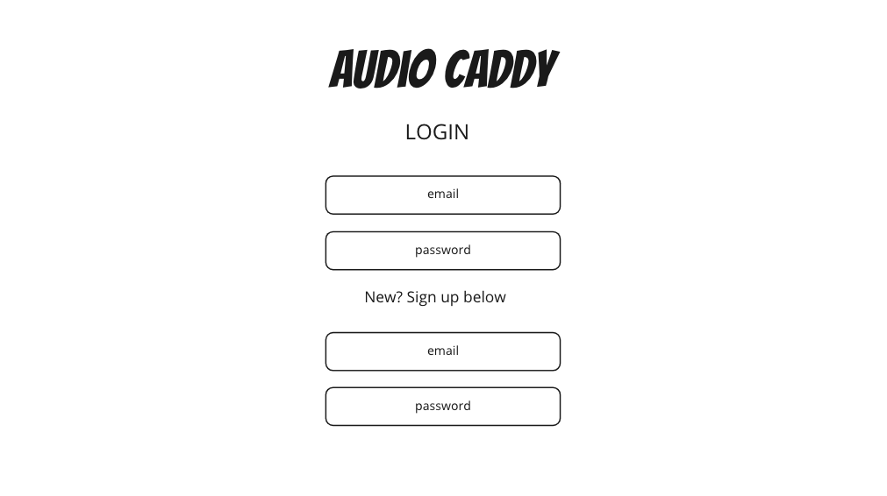
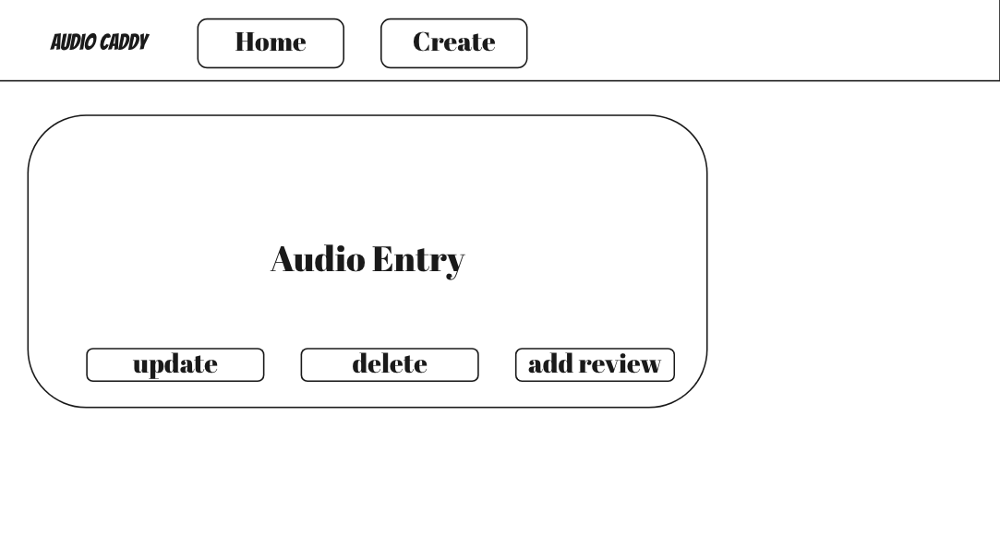
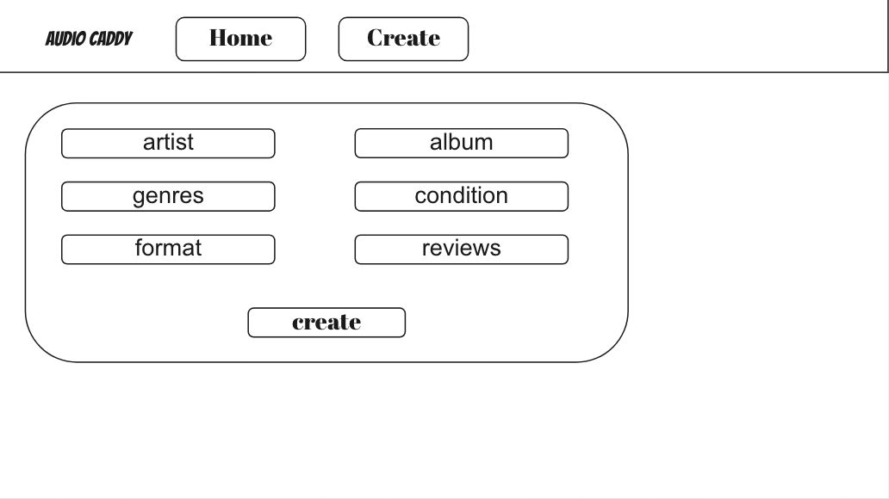
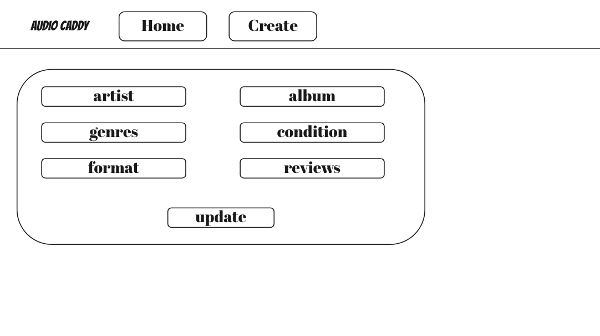
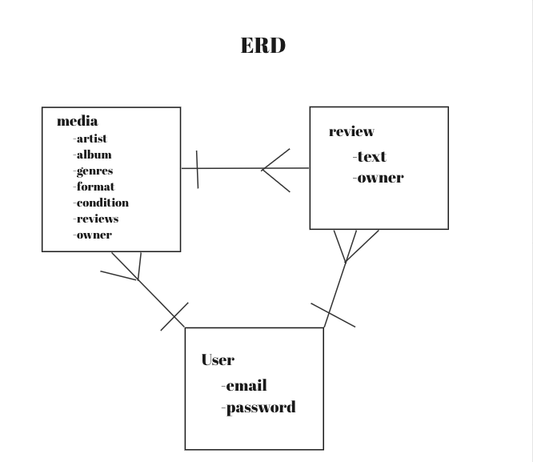

# Audio Caddy - The media collection tracker

Keep track of your physical audio collection!

## As a user
- Version 1 / MVP
    - I want the ability to create an instance of a record in my collection because I am constantly buying new records.
    - I want the ability to update a record in my collection because sometimes things change.
    - I want the ability to show any one record in my collection because sometimes I forget which records I already own.
    - I want the ability to show an index of all the records in my collection because I like to bask in the glory of my collection.
    - I want the ability to add multiple reviews to each instance of a record because I have opinions that sometimes change with each listening session.
    - I want the ability to create and account and securely sign in.
    - I want the ability to utilize my Create, Show, Index, and Delete actions from a web page because that's what a good app should do.
- Version 2
    - I want the ability to create instances of other forms of physical media in my collection, like cds, tapes, audiobooks.
    - I want the ability for other users to comment on each other's collection because it's fun to share your opinion with others.
    - I want an image to display for my collection entries because often album art is quite spectacular.
- Version 3
    - I want to be able to share my collection with someone because I think I have some cool stuff and I want everyone to know about it.
    - I want to be able to upload recordings of my records because I would like to listen to them on the go.
    - I want to be able to sell my records and other audio to other users because one day I may have too many copies.

### Landing Page

### Home Page

### Show Page

### Create Page

### Update Page

### Add Review Page

### Entity Relationships

